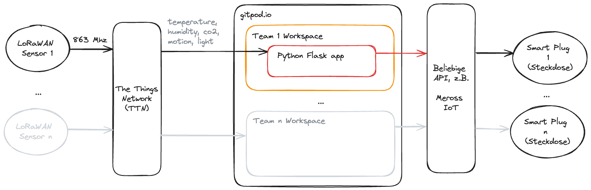
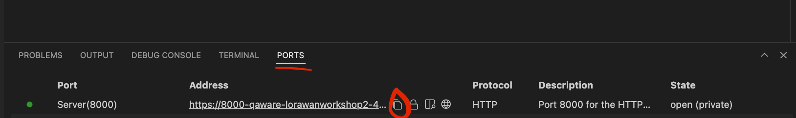

# LoRaWAN Workshop am 19.07.2024

Wir bauen eine Python Funktion um auf LoRaWAN Sensoren zu reagieren!

### Erste Schritte:
- Informiert uns, wie die öffentliche URL von eurem Python Server in GitPod lautet
    - 

So geht's

    - Die URL muss von uns in TTN eingetragen werden, ansonsten bekommt ihr keine Daten!
- Findet heraus, welche Daten in welchem Format bei euch ankommen
    - Empfehlung: Nicht `print()`, sondern den Debugger nutzen ;)
    - [Beispiel aus der TTN Doku](https://www.thethingsindustries.com/docs/the-things-stack/concepts/data-formats/#uplink-messages)
    - Falls ihr nicht auf echte Daten warten wollt, dann könnt ihr das Skript "simulate_data/send_request.sh" in einem neuen Terminal ausführen.
    - 

Spoiler - Teillösung
<code>from Flask import request, json print(request.json['uplink_message'])
  </code>

- Findet heraus, wie sich die Meross Steckdose steuern lässt.
    - Vielleicht gibt es hier im Repository eine hilfreiche Datei?
- Entscheidet, wie euer Team mit den Inputdaten umgehen will.

**Hinweis**: Bitte versucht nicht den 1-Sekunden Delay bei der Steckdose zu umgehen, sonst werden wir ggf. von Meross gesperrt.

### Weitere Schritte:
- Wie könnte man auf Trends und nicht nicht nur auf Schwellwerte reagieren?
- Wie kann man garantieren, dass die Steckdose nach 10 Minuten wieder ausgeht?
    - (Tipp: Mit `curl -X POST` im zweiten Terminal kann man die eigene API aufrufen)
- Wieviel [Strom](https://albertogeniola.github.io/MerossIot/quick-start.html#reading-sensors) verbraucht euer Endgerät?
- Was könnte man [nütz](https://www.geeksforgeeks.org/how-to-add-graphs-to-flask-apps/)liches in der App anzeigen?

### Hilfreiche Links

- Python Flask
  - [Doku](https://flask.palletsprojects.com/en/3.0.x/)
- Meross Python Library
  - [Github Repo](https://github.com/albertogeniola/MerossIot)
  - [Doku](https://albertogeniola.github.io/MerossIot/)
- GitPod.io
  - [Dashboard](https://gitpod.io/workspaces)
  - [Doku zum Öffnen von Ports](https://www.gitpod.io/docs/configure/workspaces/ports)
- TheThingsNetwork
  - [Console](https://eu1.cloud.thethings.network/console/applications)
  - [Doku mit Uplink Beispiel](https://www.thethingsindustries.com/docs/the-things-stack/concepts/data-formats/#uplink-messages)
- LoRaWAN Sensor
  - [Übersichtsseite des Herstellers mit Doku](https://www.elsys.se/en/ers-co2/)
